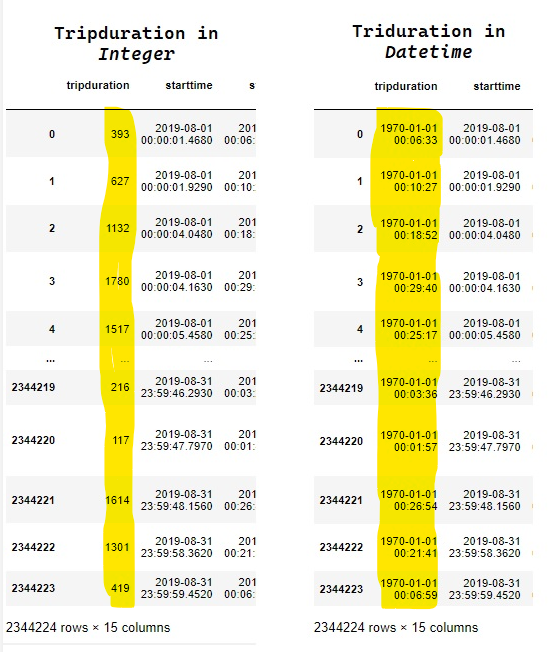
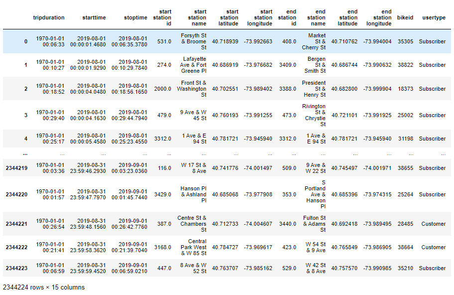
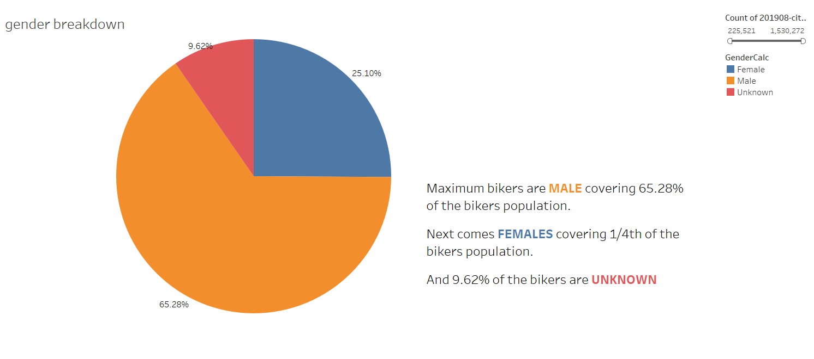

# Bike Sharing
## Overview

Citi Bike is the nation's largest bike share program, with apporx 27,350 bikes and over 1,549 stations across Manhattan, Brooklyn, Queens etc. Based on the experience in New York city, an investor is ready to invest in Kate's idea to open a similar bike business in the of city of Des Moines.
For this purpose Kate analyze the New York city bike share data and presents following reports -
* 

## Results
A complete Story board have been generated in Tabuleau to walkthrough the details of analysis [Click Here](https://public.tableau.com/views/BikeSharingWorkbook/BikeSharingStory?:language=en-US&publish=yes&:display_count=n&:origin=viz_share_link)

To analyze the data the following steps have been followed
### 1) Convert the Tripduration 
Tripduration format in the given data file was in Numeric datatype. Inorder to covert the Numeric datatype to Datetime datatype we wrote code in Pandas.
Code file - [Jupyter Notebook File](NYC_CitiBike_Challenge.ipynb)

Below image shows comparison of the data format change

 

Overall Data after the converted Tripduration

 

### 2) Gender wise Bike rider breakdown
We can see from the below data that there are more Male bikers

 

### 3) Bike Utilization
This shows the Maximum utlization of Bikes and time in which it started the rides.
After converting the Tripduration to datatime instead of numeric , instead of Average of Triduration we are using Maximum of the Tripduration value.

 

### 4) Starting and Ending Location
A quick comparison of Starting and Ending locations of bikers. 
It is pretty much same place.

  

### 5) Checkout times for User
The figure below shows the number of per hour of bike ride. A large proportions of trip lasted in less than an hour. Bikes are not used for long hours of durations.

 

### 6) Checkout times by Gender
For most men and women, the average duration of biking is less than an hour.

 

### 7) Trips per weekday per Hour
The figure shows that peak hours are morning 8am - 9am and evening 5pm - 7pm on most weekdays, Thursday evening looks to be most peak time.
During weekends day time gets busier compared to morning and evenings.

 

### 8) Trips by gender and Weekday per hour
For both male and female riders, the demand for bike riding is high between morning 8am - 9am and evening 5pm to 6pm

 

### 9) Trips by Weekday and gender
-  Subscribers are more likely to use the bike share services.
-  Most subscibers are Male 
-  All the Unknowns are non - subscibers. which makes sense that their data is not stored in out database as they just come and use the services without subscribing.

 

## Summary
Based on the analysis we can conclude that
* Percentage of Male bikers is higher compared to Female and there is some part of Unknown who are non subscibers
* Most bikers used in Morning and Evening during weekdays. Day time usage is very less during weekdays compared to weekends.
* There is high % of subscribers , however, the non subscribers are also using the services which is a good too.
